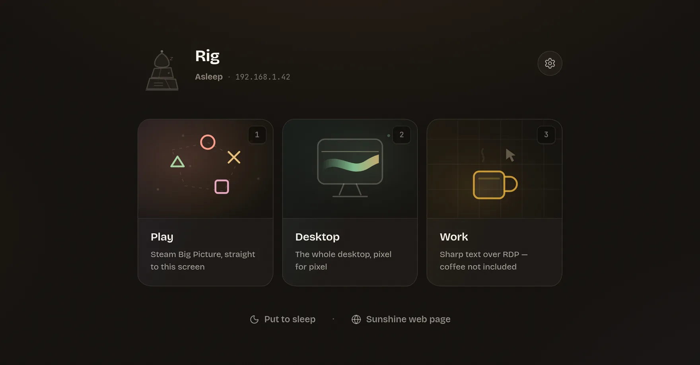
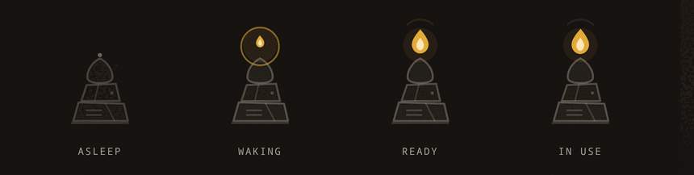

<div align="center">


# Varde

**One calm launcher for waking, streaming, and remoting into your PC.**

Wake-on-LAN, Moonlight/Sunshine game streaming and Remote Desktop behind
one home screen — for Linux and Windows, against a headless Windows PC.

[Download](https://github.com/mjlading/varde/releases/latest) ·
[Install](#install) ·
[Docs](docs/) ·
[Contributing](CONTRIBUTING.md) ·
[Report a bug](https://github.com/mjlading/varde/issues/new)

[![CI][ci-badge]][ci-link]
[![Latest release][rel-badge]][rel-link]
[![License][lic-badge]][lic-link]
[![Platform][plat-badge]][plat-link]

<picture>
  <source media="(prefers-color-scheme: dark)" srcset="docs/assets/hero-oled.webp">
  <source media="(prefers-color-scheme: light)" srcset="docs/assets/hero-cozy.webp">
  
</picture>

*A varde is a Norwegian signal cairn — stone beacons lit in chains, one
hill waking the next. This one wakes your gaming PC.*

</div>

## What it is

Varde is not another Moonlight client — it's the **lifecycle companion**
around the tools you already use. Moonlight renders your stream and
FreeRDP renders your desktop; Varde does everything around them that
normally means a terminal, a wiki page, or walking over to the machine.

- **Play** — stream your game app (Steam Big Picture) via Moonlight.
- **Desktop** — stream the full desktop, pixel for pixel.
- **Work** — Remote Desktop, requesting Windows' RDP8 graphics pipeline
  *and* checking the host policy that makes it real.
- **Wakes first, always.** A magic packet is a link-layer broadcast: it
  dies at the first router. So waking is three transports — WoL, an HTTP
  URL, or an SSH relay beside the PC — all tried, one success enough.
- **Fixes the black screen.** Nobody logged in, or a desktop parked on
  an RDP session, and streaming shows the same black picture. With SSH,
  Varde repairs both before Moonlight starts.
- **Calm by principle.** While a session runs, every ambient animation
  freezes, the status poll stretches, and your CPU cycles go to video
  decoding instead of ambience.

<div align="center">
<br>

<br>
<sub>A snoring stone-cairn mascot whose beacon fire <i>is</i> the status display.</sub>
<br><br>
</div>

Any action against a sleeping PC **wakes it first**, narrates real
milestones ("answering the network → Windows starting"), shows a progress
bar calibrated to how long the last wake actually took — and tells you
what actually happened when it fails.

## Why not just Moonlight?

| | Moonlight alone | With Varde |
|---|---|---|
| PC asleep | nothing happens | woken first, from three directions, narrated |
| PC at the login screen | black stream | logged in over SSH, then streamed |
| You used Remote Desktop earlier | black stream | console handed back before launch |
| Done for the night | walk over to the PC | one tile, or `varde sleep` |

**Ctrl+Alt+Shift+D swaps the two legs in place** — streaming becomes a
desktop; a desktop closes, hands the screen back, and resumes streaming.

## Does it work with my setup?

|  | Supported |
|---|---|
| **This app runs on** | Linux · Windows |
| **Your gaming PC runs** | Windows, with [Sunshine](https://github.com/LizardByte/Sunshine) or [Apollo](https://github.com/ClassicOldSong/Apollo) |
| **Best parts need** | key-based SSH to that PC ([how](docs/host-setup.md)) |

> [!IMPORTANT]
> The Linux client is primary and battle-tested against a real headless
> Windows host. The Windows client builds in CI but has had less
> real-world use — reports welcome. macOS is not supported yet.

No telemetry, no accounts, no relay servers.

## Install

Grab an installer from [Releases](https://github.com/mjlading/varde/releases/latest)
— `deb`, `rpm` or `AppImage` on Linux, `msi` or `exe` on Windows — then
launch it and follow the wizard.

<details>
<summary><b>Two things that trip people up</b></summary>

<br>

**Windows:** the installers aren't code-signed yet, so SmartScreen may
say "Windows protected your PC" — click **More info → Run anyway**.

**AppImage:** make it executable first (right-click → Properties → allow
executing, or `chmod +x`). The `deb`/`rpm` packages install by
double-click on most desktops.

Full notes: [docs/install.md](docs/install.md).

</details>

Varde launches other tools rather than replacing them, so install the
legs you'll use: [Moonlight](https://moonlight-stream.org) for streaming,
FreeRDP 3 for Remote Desktop on Linux (Windows has `mstsc` built in), and
an OpenSSH client for sleep and the handover. The wizard checks all three
and gives you the install command for your own package manager.

The PC needs Sunshine or Apollo installed once — see
[Setting up the PC](docs/host-setup.md).

## The terminal face

The same binary, headless:

```
varde status     # reachability, ports, busy-state (exit codes for scripts)
varde wake       # fire every configured wake transport
varde play       # wake if needed, wait, stream the game app
varde desktop    # …or the full desktop
varde work       # …or Remote Desktop
varde sleep      # put the PC to sleep over SSH
varde hosts      # list configured PCs
```

`varde wake && varde play` on a keybinding does everything the Play tile
does. [Full reference](docs/cli.md).

## Honest expectations

- **Varde launches Moonlight; it doesn't replace it.** Once video
  starts, that's Moonlight's renderer. The polished experience is
  everything around it.
- **Pairing stays a two-step ritual.** Typing the PIN into the host's
  web page is the host's half of the handshake; Varde streamlines it to
  "click the link, type 4 digits" but can't remove it.
- **A PC on Wi-Fi can't wake from full shutdown** — only from sleep.
  Varde tells you when that's the likely story.

RDP passwords never touch `settings.json`; opt-in storage goes to the OS
keyring. See [SECURITY.md](SECURITY.md).

## Docs

[Installing](docs/install.md) ·
[Setting up the PC](docs/host-setup.md) ·
[Waking](docs/waking.md) ·
[Remote Desktop](docs/remote-desktop.md) ·
[Streaming quality](docs/streaming.md) ·
[The CLI](docs/cli.md)

## Contributing

Built with Tauri 2 (Rust) and React. `npm install && npm run tauri dev`
gets you running; [CONTRIBUTING.md](CONTRIBUTING.md) has the system
dependencies, the code layout, and the two house rules. Issues and pull
requests welcome.

## License

[GPL-3.0-or-later](LICENSE) — the same family as the ecosystem this
builds on. Varde launches those tools as separate processes and links
none of their code; the copyleft is a choice, not an obligation.

[ci-badge]: https://github.com/mjlading/varde/actions/workflows/ci.yml/badge.svg?branch=main
[ci-link]: https://github.com/mjlading/varde/actions/workflows/ci.yml
[rel-badge]: https://img.shields.io/github/v/release/mjlading/varde?sort=semver&display_name=tag&color=e79c50
[rel-link]: https://github.com/mjlading/varde/releases/latest
[lic-badge]: https://img.shields.io/github/license/mjlading/varde?color=blue
[lic-link]: LICENSE
[plat-badge]: https://img.shields.io/badge/platform-Linux%20%7C%20Windows-lightgrey
[plat-link]: #does-it-work-with-my-setup
